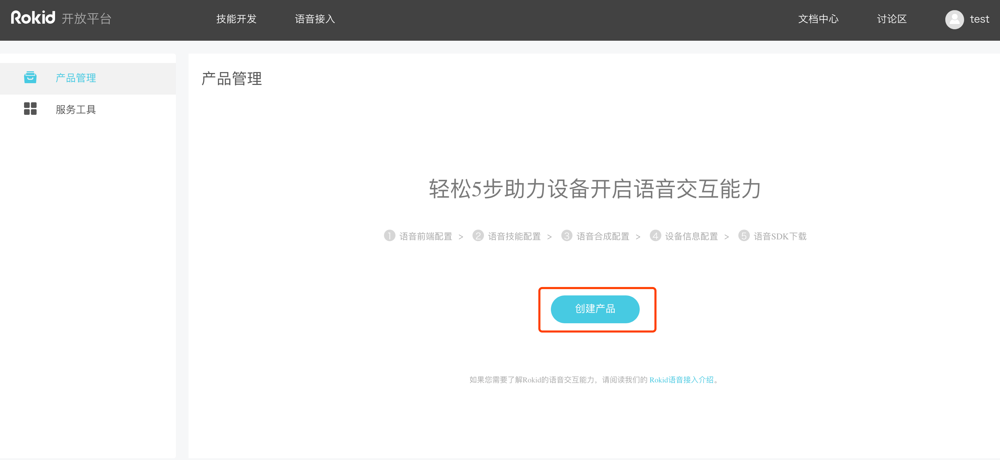
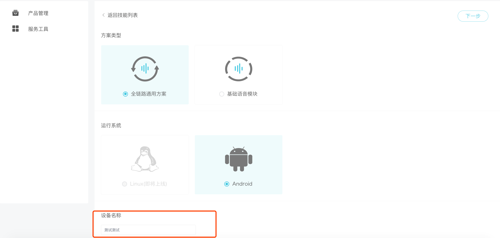
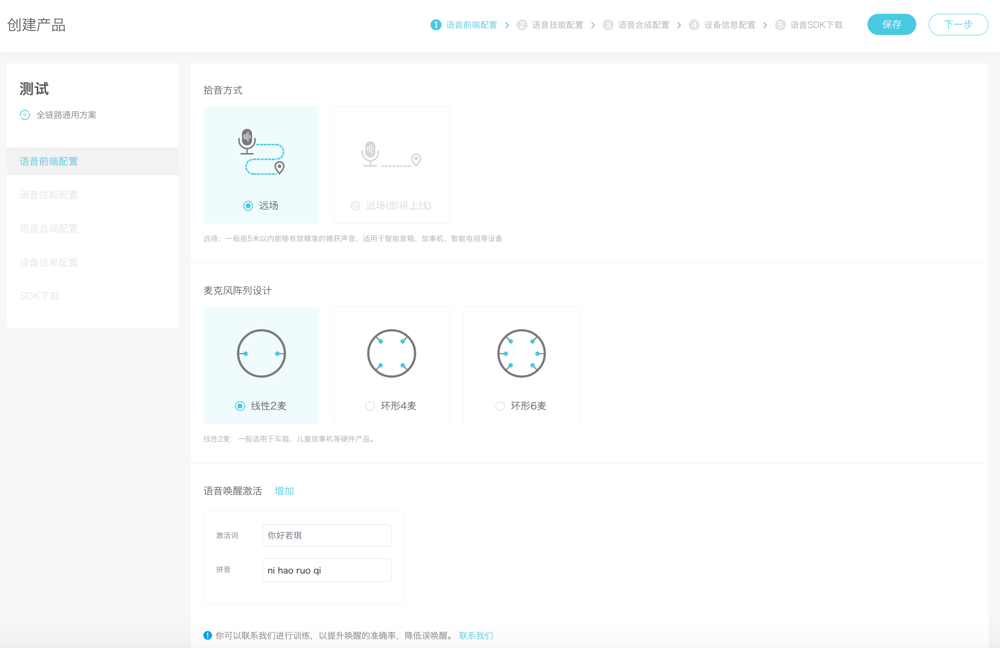
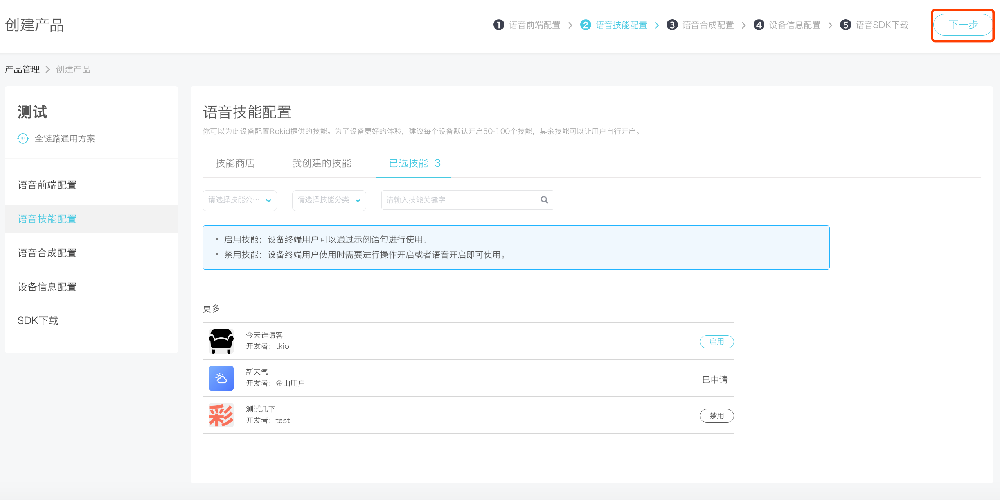
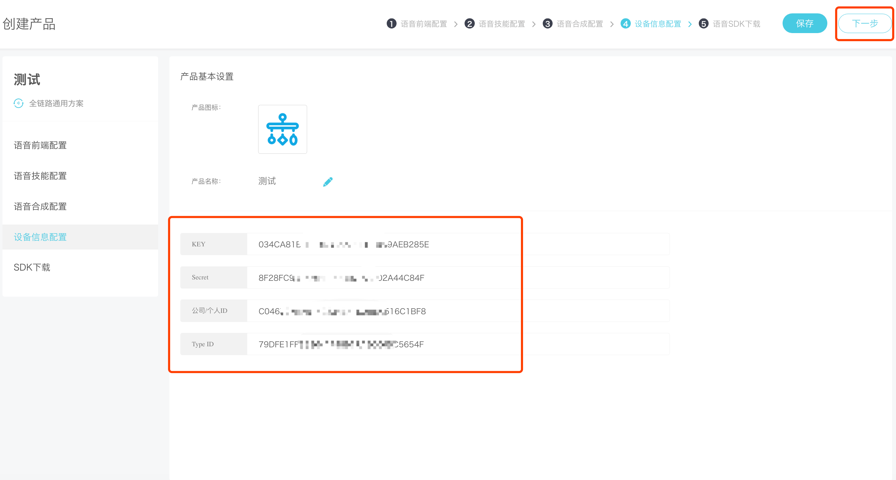
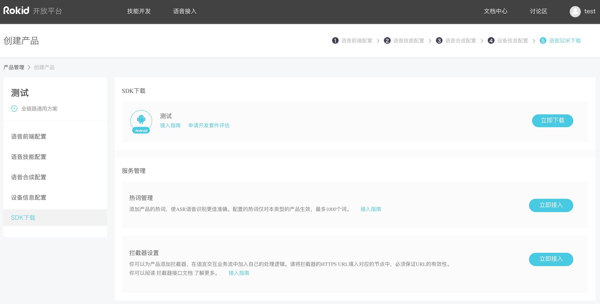

1. 登陆[开放平台](#)后，选择语音接入，单击「创建产品」开始创建

2. 默认选择「全链路通用方案」和「Android」，可安需重新选择，然后在红色框框标记处给你的设备取一个名字。 

3. 拾音方式默认值「远场」，麦克风阵列设计默认值「线性2麦」，可按需选择，然后填写「激活词」，将自动生成「拼音」。

4. 在技能商店选择需要接入的技能，如果涉及到需要授权的技能，先申请授权。还可选择「我创建的技能」，然后所选的技能会展示在「已选技能」，如下图所示：

5. 如下图所示，调整好语音的各项参数，可选择试听。然后进入「下一步」。

6. 如下图所示，添加「产品图标」，可修改「产品名称」，图中的Key、Secret、公司/个人ID、TypeID全部自动生成。

7. 如下图，最后一步可下载SDK、接入热词、设置拦截器。

